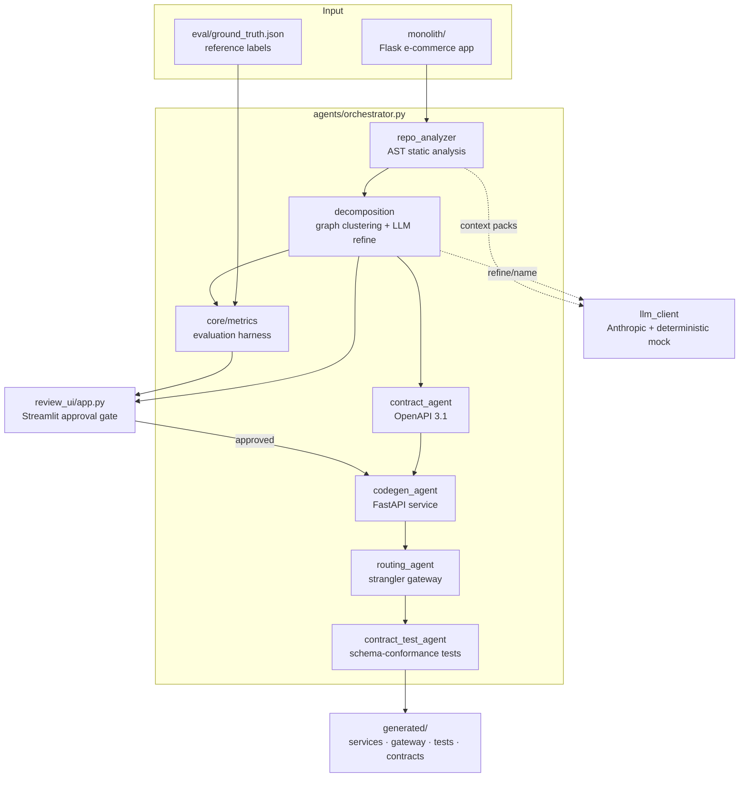
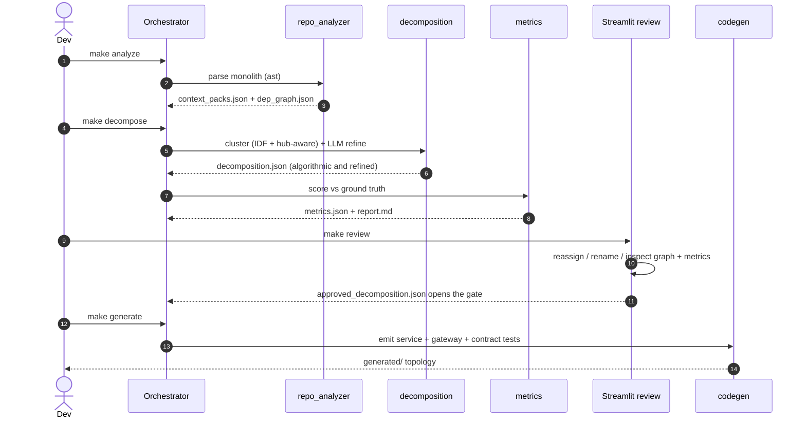
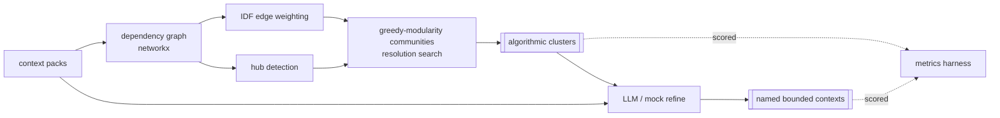
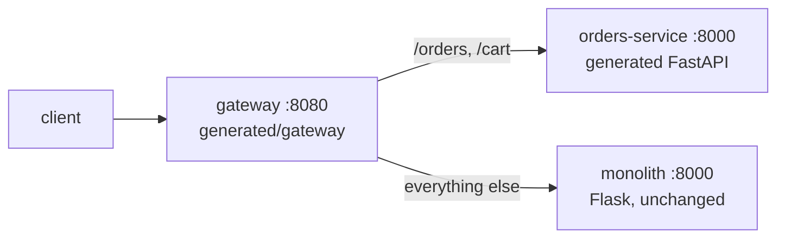

# mono2micro

A migration assistant that proposes microservice boundaries for a monolith,
scores the proposal against a ground-truth partition, gates it behind human
review, and generates a runnable strangler-fig topology from the approved
result.

It runs offline against a deterministic mock LLM, and identically against a real
Anthropic key. There is no agent framework — a small orchestrator coordinates
six single-purpose agents, and every step writes an inspectable artifact to
disk.

## Running it

```bash
make install          # create .venv and install deps (once)
make all              # analysis through codegen, non-interactive, mock LLM
make test             # 65 tests, fully offline
make demo             # strangler routing (Docker if present, else in-process)
```

For the interactive review instead of `make approve`:

```bash
make analyze decompose
make review           # Streamlit: reassign, rename, approve
make generate demo
```

No credentials are needed. For the real LLM path:

```bash
export LLM_MODE=real ANTHROPIC_API_KEY=sk-... ANTHROPIC_MODEL=claude-sonnet-5
make decompose
```

## Architecture



Every arrow is a JSON, YAML or Markdown artifact on disk:



## The sample monolith

A Flask e-commerce app of 14 modules across 6 bounded contexts plus a shared
kernel, with cross-cutting imports that make decomposition non-trivial.

| Context | Modules |
|---|---|
| Platform (shared kernel) | `app`, `config`, `db`, `models` |
| Users/Auth | `auth`, `users` |
| Catalog | `discovery`, `rating` |
| Inventory | `inventory` |
| Orders | `orders`, `basket`, `logistics` |
| Payments | `payments` |
| Notifications | `notifications` |

`orders.checkout()` imports Catalog, Inventory, Payments, Users and
Notifications. That is why pure modularity maximisation merges these contexts,
and why a semantic signal is needed to separate them again.

Three modules — `discovery`, `rating`, `basket` — are named for their mechanism
rather than their domain, so classification has to work from behaviour rather
than filenames. `logistics` sits across two contexts: it belongs to the Orders
lifecycle but its code is warehouse-stock manipulation. `eval/ground_truth.json`
holds the reference labels and documents these cases in `realism_notes`.

## Dependency analysis

`agents/repo_analyzer.py` walks the AST of each module and emits a context pack:
imports (internal and external), functions, classes, Flask routes, and entity
definitions. `core/graph.py` builds a weighted directed graph from the internal
imports, applies IDF weighting to damp edges into shared-kernel hubs, and
identifies the composition root and shared kernel by degree.

## Decomposition and evaluation



The algorithmic clusters and the refined services are stored and scored
separately, so the report attributes the result to each signal.

`core/metrics.py` implements every metric directly rather than calling sklearn
or scipy, and the unit tests pin each one to a hand-computed value. It reports
three families:

- Clustering agreement, alignment-free: Adjusted Rand Index, Rand Index,
  pairwise precision/recall/F1, NMI, homogeneity, completeness, V-measure.
- Per-service precision/recall/F1, after matching predicted to ground-truth
  services one-to-one with the Hungarian algorithm.
- Graph structure: Newman modularity, cohesion, afferent and efferent coupling,
  instability `I = Ce/(Ca+Ce)`, inter-service cut ratio.

### Results

Mock mode, reproducible with `make eval`:

| Partition | Services | ARI | NMI | Macro-F1 | Modularity Q | Cut ratio |
|---|---|---|---|---|---|---|
| refined (proposed) | 7 | 0.839 | 0.936 | 0.924 | −0.097 | 0.818 |
| algorithmic (graph only) | 4 | 0.169 | 0.582 | 0.403 | −0.041 | 0.709 |
| louvain | 2 | −0.050 | 0.208 | 0.121 | 0.107 | 0.315 |
| random (mean of 50) | 6 | 0.021 ± 0.112 | 0.583 | 0.460 | −0.082 | 0.835 |
| single service | 1 | 0.000 | 0.000 | 0.063 | 0.000 | 0.000 |
| per module | 14 | 0.000 | 0.814 | 0.748 | −0.103 | 1.000 |
| ground truth | 7 | 1.000 | 1.000 | 1.000 | −0.121 | 0.836 |

Structural clustering alone reaches ARI 0.169; it under-segments because the
bounded contexts really are coupled. Semantic refinement lifts that to 0.839, a
delta of +0.67 on this monolith.

The refined partition recovers 13 of 14 modules, including all three
mechanism-named ones. The remaining error is `logistics`, filed under Inventory
rather than Orders. Per-service F1 is 1.00 everywhere except Orders (0.80,
recall) and Inventory (0.67, precision). The ground-truth labels were not
adjusted to raise the score.

Two calibration points make the headline number readable. The mean of 50 random
partitions is ARI 0.021 ± 0.112, and naive modularity maximisation scores
−0.050, so 0.839 reflects agreement rather than chance. ARI leads the table
rather than NMI because NMI rewards fine partitions — `per_module` scores NMI
0.814 at ARI 0.000.

Modularity is the wrong objective on this graph. The ground-truth partition
itself scores Q = −0.121, because the shared kernel couples everything, so a
partition optimising Q is further from the answer, not closer. The
cohesion/coupling figures agree with the roles: Orders is the least stable
service, depending on almost everything, and Platform the most stable, depended
upon by almost everything.

## Human-in-the-loop review

`streamlit run review_ui/app.py` shows the headline metrics, the dependency
graph coloured by proposed service with cross-service edges dashed, per-module
reassignment controls, and rename/new-service controls. Approving writes
`eval/approved_decomposition.json`.

`make generate` refuses to run until that file exists and is approved.
`make approve` is the non-interactive equivalent used by `make all` and writes
the identical file.

## Service extraction

From the approved Orders contract, three agents emit source rather than
interpreting a spec at runtime:

```
generated/
  contracts/Orders.yaml            OpenAPI 3.1, typed schemas from entity annotations
  services/orders/{main,models}.py FastAPI skeleton: pydantic models (topo-sorted),
                                   stub handlers, /health, X-Served-By header
  gateway/{routing,main}.py        strangler gateway + routes.yaml route table
  tests/test_orders_contract.py    pytest: status + JSON-Schema conformance
```



Requests for the extracted context reach the new service; everything else falls
through to the monolith. The gateway sets `X-Gateway-Backend` and `X-Served-By`
so routing is observable.

`docker/` holds `Dockerfile.{monolith,service,gateway}`, `docker-compose.yml`
and a `.dockerignore`. With Docker available:

```bash
make generate
docker compose -f docker/docker-compose.yml up --build
curl -i localhost:8080/orders/1          # X-Gateway-Backend: orders-service
curl -i localhost:8080/catalog/products  # X-Gateway-Backend: monolith
docker compose -f docker/docker-compose.yml down
```

`make verify-runtime` covers the same ground without a Docker daemon. It runs
the exact commands the Dockerfiles use (`python -m monolith.app`,
`uvicorn main:app`) as localhost processes and drives the gateway's real
async-httpx forwarding path, confirming all three tiers come up healthy and that
`/orders/*` routes to the new service while other paths route to the monolith.
`make demo` prefers this check and falls back to the in-process
`tests/test_strangler_integration.py` path if it cannot bind ports.

## Layout

```
mono2micro/
  monolith/            sample Flask monolith
  agents/              orchestrator, six agents, llm_client
  core/                context_pack (pydantic) · graph · metrics
  review_ui/           Streamlit review app + review_logic
  generated/           output: services, gateway, contracts, tests, artifacts
  eval/                ground_truth.json · metrics.json · report.md
  docker/              Dockerfiles + docker-compose.yml
  tests/               tooling and strangler integration tests
  scripts/             demo.sh · local_demo.py · verify_runtime.sh
```

## Configuration

| Variable | Default | Meaning |
|---|---|---|
| `LLM_MODE` | `mock` | `mock` (offline, deterministic) or `real` (Anthropic) |
| `ANTHROPIC_MODEL` | `claude-sonnet-5` | model id, read from env |
| `ANTHROPIC_API_KEY` | — | required only for `real` mode |
| `MONOLITH_URL` / `ORDERS_URL` | docker DNS | gateway backend URLs |

See `.env.example`.

## Design decisions

A few choices worth explaining, since they shape the results.

**No agent framework.** The orchestrator is around 220 lines and each command is
an explicit method that reads and writes JSON. LangChain or CrewAI would add a
control flow I would then have to explain; here every intermediate state is a
file you can open.

**Two signals, kept separate.** Structural clustering and semantic refinement
are stored and scored independently. Reporting only the combined number would
hide which part is doing the work — and on this monolith, structure alone is
worth ARI 0.169.

**Metrics implemented directly.** sklearn would be one import, but the metrics
are the substance of the evaluation, so they are written out and pinned to
hand-computed values in the tests. The Hungarian matching for per-service F1 is
the same story.

**Mock LLM by default.** The mock is a keyword lexicon over the context packs,
deterministic and offline. It makes the pipeline reproducible and testable
without credentials, at the cost of being weaker than a real model on ambiguous
modules.

**Generated code, not runtime interpretation.** The codegen agents emit readable
FastAPI source rather than serving from the OpenAPI document, because the output
of a migration tool should be code a team can own and edit.

## Limitations

- The sample monolith is synthetic and cleanly factored, and the mock refiner is
  a keyword lexicon, so mock-mode scores are optimistic. Real codebases have
  ambiguous and poorly-named modules where scores land lower.
- Static analysis is import- and AST-based. It does not resolve dynamic
  dispatch, runtime dependency injection, reflection, or calls made through
  strings and configuration.
- Generated handlers are stubs returning schema-valid examples. They encode the
  shape of the contract, not business logic or persistence.
- Data ownership and shared-database decoupling, the hardest part of a real
  migration, are out of scope. The shared kernel is identified but not split.

## Future work

- Replace the keyword mock with a real LLM refinement loop and report the ARI/F1
  distribution across several open-source monoliths.
- Add call-graph and data-flow edges rather than imports alone, and weight the
  graph with co-change signal mined from git history.
- Learn the clustering resolution and hub thresholds instead of searching a grid
  against heuristics.
- Generate a data-decomposition plan (per-service tables, anti-corruption
  layers) and saga/outbox scaffolding for cross-service transactions.
- Diff the extracted service against recorded monolith traffic rather than the
  static schema alone.
- CI that runs the pipeline and fails a PR when a refactor drops ARI or F1.

## Tests

```bash
make test        # 65 tests, ~1s, offline
```

Covering AST analysis, graph and hub behaviour, the metric suite pinned to
hand-computed values, decomposition quality and determinism, OpenAPI generation
and validation, LLM-client mock determinism and real-mode guardrails, the
monolith's cross-context checkout, the review logic and approval gate, the
generated contract tests, and the offline strangler integration.
