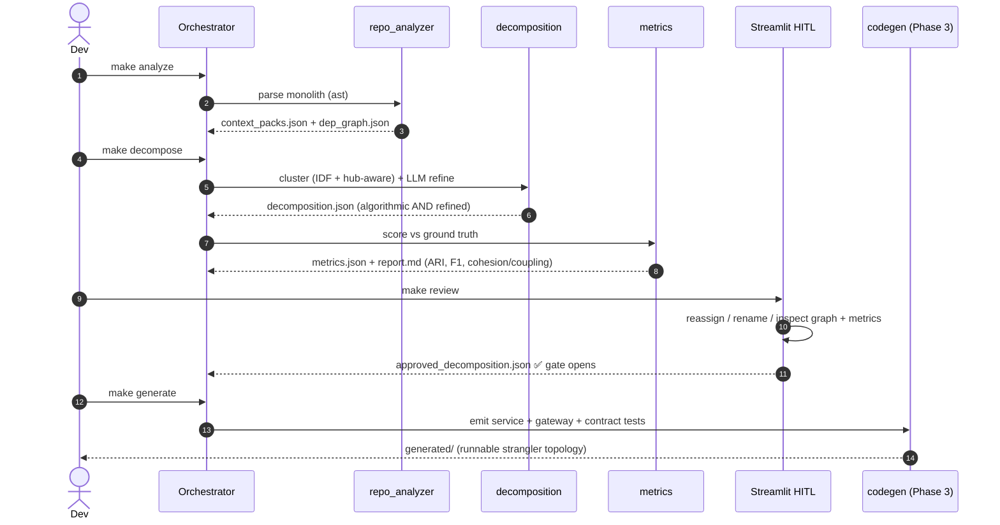
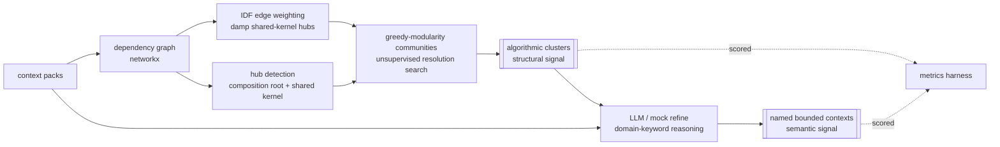
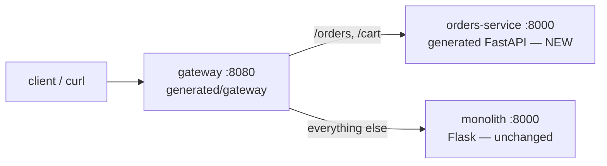

# mono2micro — AI-Driven Monolith → Microservice Migration Assistant

A runnable, multi-agent system that migrates a monolith to microservices with a
**human-in-the-loop** review gate. It statically analyses a codebase, proposes
service boundaries by **combining graph community detection with LLM domain
reasoning**, **quantitatively scores** the proposal against a ground-truth
partition, gates the result behind a Streamlit review, and then generates a
runnable **strangler-fig** topology (extracted FastAPI service + gateway +
contract tests + Docker).

Everything runs **offline** with a deterministic **mock LLM** (no API key) and
identically with a real Anthropic key. There is **no LangChain / LlamaIndex /
CrewAI / AutoGen** — a small custom orchestrator keeps every step inspectable.

> Built as a Data-Science / ML portfolio project: the emphasis is on
> **algorithmic depth** (from-scratch clustering-evaluation harness) and
> **quantitative rigour** (a calibrated metric battery), not just a working demo.

---

## TL;DR — run it

```bash
make install          # create .venv and install deps  (once)
make all              # Phase 1→3 end-to-end, non-interactive, mock LLM
make test             # 65 tests: tooling + generated contracts + strangler proof
make demo             # live strangler routing (Docker if present, else in-process)

# interactive human-in-the-loop review instead of `make approve`:
make analyze decompose
make review           # Streamlit app -> reassign/rename/APPROVE
make generate demo
```

No credentials are needed. For the **real** LLM path:

```bash
export LLM_MODE=real ANTHROPIC_API_KEY=sk-... ANTHROPIC_MODEL=claude-sonnet-5
make decompose        # the model name is read from env — never hardcoded
```

---

## Architecture


**Pipeline (every arrow is an inspectable JSON/YAML/MD artifact on disk):**



### Decomposition: two signals, kept separate



The **algorithmic** clusters and the **LLM-refined** services are logged and
scored separately, so the report shows exactly what each signal contributed
(see *Evaluation* below — the semantic layer adds **+0.67 ARI** over structure
alone on the sample monolith).

### Strangler-fig topology (Phase 3 output)



Requests for the **extracted** context (`/orders`, `/cart`) hit the new service;
everything else falls through to the still-running monolith. The gateway stamps
`X-Gateway-Backend` / `X-Served-By` so routing is observable.

---

## The synthetic monolith (Phase 0)

A small but realistic Flask e-commerce app — **14 modules, 6 bounded contexts +
a shared kernel** — with deliberately cross-cutting imports so decomposition is
non-trivial:

| Context | Modules | Notes |
|---|---|---|
| Platform (shared kernel) | `app`, `config`, `db`, `models` | composition root + shared entities |
| Users/Auth | `auth`, `users` | |
| Catalog | `discovery`, `rating` | **domain-neutral names** (browse / pricing) |
| Inventory | `inventory` | |
| Orders | `orders`, `basket`, `logistics` | **extraction target**; `logistics` is deliberately **ambiguous** |
| Payments | `payments` | |
| Notifications | `notifications` | |

**Controlled realism (so scores aren't an artifact of tidy filenames):**
- `discovery` (catalogue browse), `rating` (pricing) and `basket` (cart) use
  **domain-neutral filenames** — the classifier must infer their context from
  *behaviour*, and it still gets all three right.
- `logistics` genuinely **straddles two contexts**: it belongs to the Orders
  lifecycle (its ground-truth label) but its behaviour is pure warehouse-stock
  manipulation, so a content classifier reasonably mis-files it under Inventory.
  This is an honest, defensible error — the gold labels were **not** tweaked to
  make numbers look good (see `eval/ground_truth.json` → `realism_notes`).

`orders.checkout()` imports Catalog, Inventory, Payments, Users **and**
Notifications — which is exactly why the dependency graph merges these contexts
under pure modularity, and why the semantic layer is needed to pull them apart.
`eval/ground_truth.json` labels each module; that is the gold standard the
decomposition is scored against.

---

## Evaluation (the DS/ML core — `core/metrics.py`)

All metrics are implemented **from first principles** (no sklearn/scipy) so the
formulas are inspectable, and unit-tested against hand-computed values. The
harness reports three families:

- **Clustering agreement** (alignment-free): Adjusted Rand Index, Rand Index,
  pairwise Precision/Recall/F1, NMI, Homogeneity, Completeness, V-measure.
- **Per-service P/R/F1** after an **optimal one-to-one match** of predicted to
  ground-truth services via a **from-scratch Hungarian algorithm**.
- **Graph-structural**: Newman modularity, cohesion, afferent/efferent coupling
  (Ca/Ce), instability `I = Ce/(Ca+Ce)`, inter-service cut ratio.

### Sample results (mock mode, reproducible via `make eval`)

| Partition | #Services | ARI | NMI | Macro-F1 | Modularity Q | Cut ratio |
|---|---|---|---|---|---|---|
| **refined (proposed)** ⭐ | 7 | **0.839** | 0.936 | 0.924 | −0.097 | 0.818 |
| algorithmic (graph only) | 4 | 0.169 | 0.582 | 0.403 | −0.041 | 0.709 |
| louvain (naive) | 2 | −0.050 | 0.208 | 0.121 | 0.107 | 0.315 |
| random (mean of 50) | 6 | 0.021 ± 0.112 | 0.583 | 0.460 | −0.082 | 0.835 |
| single service | 1 | 0.000 | 0.000 | 0.063 | 0.000 | 0.000 |
| per module | 14 | 0.000 | 0.814 | 0.748 | −0.103 | 1.000 |
| ground truth (upper bound) | 7 | 1.000 | 1.000 | 1.000 | −0.121 | 0.836 |

**How to read this — four deliberate lessons:**

1. **The semantic layer earns its keep.** Structural clustering alone reaches
   ARI 0.17 (it under-segments coupled contexts); LLM/keyword refinement lifts
   it to **0.84** — a **+0.67** delta on the sample monolith.
2. **Strong but honestly imperfect.** ARI 0.84 (Macro-F1 0.92), *not* a perfect
   1.00: the classifier recovers 13/14 modules — including the three
   domain-neutral-named ones — and makes exactly **one defensible error**, filing
   the ambiguous `logistics` module under Inventory instead of Orders. Per-service
   F1: everything 1.00 except Orders (0.80, recall hit by the missing `logistics`)
   and Inventory (0.67, precision hit by the extra `logistics`).
3. **The suite is calibrated.** The **mean of 50 random** partitions is ARI
   0.02 ± 0.11; naive modularity-maximising clustering (louvain) actively
   *mis-groups* domains (ARI −0.05). So 0.84 reflects real agreement, not luck.
4. **ARI, not NMI, is the headline.** NMI is inflated by fine partitions —
   `per_module` scores NMI 0.81 but ARI 0.00. ARI is chance-corrected and
   robust to cluster count.

**Bonus — modularity is the *wrong* objective here.** The ground-truth partition
itself has Q = −0.12 on the raw graph (the shared kernel couples everything), so
a partition that maximises modularity is *worse*, not better. This is the whole
argument for combining structure with domain semantics.

**Cohesion/coupling confirms the roles** (Martin's stability metrics): `Orders`
is the most unstable service (an orchestrator that depends on everything) while
`Platform` is the most stable (a shared kernel depended upon by everything) —
exactly the seams a migration addresses first.

> **Why the score is 0.84 and not 1.00 (by design):** three modules use
> domain-neutral filenames and one (`logistics`) genuinely straddles Orders and
> Inventory, so the keyword classifier can't ride on tidy names and makes one
> honest boundary error. The gold labels were never adjusted to inflate the
> number. On a messy real codebase — or with the mock swapped for a real LLM over
> more ambiguous modules — expect scores in this same "strong but imperfect"
> band, which is exactly the point.

---

## Human-in-the-loop review (`make review`)

`streamlit run review_ui/app.py` opens the review app:

- headline metrics (ARI, Macro-F1, V-measure, cut ratio),
- the dependency graph **coloured by proposed service** (cross-service edges
  dashed — the seams), with the extraction target outlined,
- per-module **reassignment** dropdowns and **new-service / rename** controls,
- an **APPROVE** button that writes `eval/approved_decomposition.json`.

**Phase 3 is hard-gated**: `make generate` refuses to run until that file exists
and is approved. `make approve` is the non-interactive equivalent (used by
`make all` / CI); it writes the identical gate file.

---

## What Phase 3 generates

From the approved Orders contract, `codegen_agent` / `routing_agent` /
`contract_test_agent` emit **real, readable source** (not a runtime spec
interpreter):

```
generated/
  contracts/Orders.yaml            OpenAPI 3.1 (typed schemas from entity annotations)
  services/orders/{main,models}.py FastAPI skeleton: pydantic models (topo-sorted),
                                   stub handlers, /health, X-Served-By header
  gateway/{routing,main}.py        strangler gateway + routes.yaml route table
  tests/test_orders_contract.py    pytest: status + JSON-Schema conformance vs contract
```

`docker/` contains `Dockerfile.{monolith,service,gateway}` + `docker-compose.yml`
(+ a `.dockerignore` so builds don't ship `.venv`/`.git`). With Docker installed:

```bash
make generate
docker compose -f docker/docker-compose.yml up --build
curl -i localhost:8080/orders/1          # X-Gateway-Backend: orders-service  (NEW)
curl -i localhost:8080/catalog/products  # X-Gateway-Backend: monolith        (OLD)
docker compose -f docker/docker-compose.yml down
```

**Verifying the runtime without Docker.** This project was built on a host with
no Docker daemon, so `make verify-runtime` (`scripts/verify_runtime.sh`) launches
the **exact commands the Dockerfiles run** (`python -m monolith.app`,
`uvicorn main:app`) as real localhost processes and drives the gateway's **real
async-httpx forwarding path** — the same code that runs in the containers, minus
containerisation. It confirms all three tiers become healthy and that
`/orders/*` → new service while other routes → monolith. `make demo` prefers this
real-HTTP check and only falls back to the in-process
`tests/test_strangler_integration.py` path if it can't bind localhost ports.

---

## Project layout

```
mono2micro/
  monolith/            synthetic Flask monolith (Phase 0)
  agents/              orchestrator + 7 inspectable agents + llm_client
  core/                context_pack (pydantic) · graph · metrics harness
  review_ui/           Streamlit HITL app + unit-tested review_logic
  generated/           OUTPUT: services/ gateway/ contracts/ tests/ + artifacts
  eval/                ground_truth.json · metrics.json · report.md · approved_*.json
  docker/              Dockerfiles + docker-compose.yml
  tests/               tooling + strangler integration tests (pytest)
  scripts/             demo.sh (docker-or-local) · local_demo.py
  Makefile · PLAN.md · README.md · requirements.txt
```

---

## Configuration

| Env var | Default | Meaning |
|---|---|---|
| `LLM_MODE` | `mock` | `mock` (offline, deterministic) or `real` (Anthropic) |
| `ANTHROPIC_MODEL` | `claude-sonnet-5` | model id — **read from env, never hardcoded** |
| `ANTHROPIC_API_KEY` | — | required only for `real` mode |
| `MONOLITH_URL` / `ORDERS_URL` | docker DNS | gateway backend URLs at runtime |

See `.env.example`.

---

## Limitations & future work

**Limitations**
- The sample monolith is synthetic and cleanly factored; the mock refiner is a
  keyword lexicon, so mock-mode scores are optimistic (see the note above). Real
  codebases have ambiguous, poorly-named modules where scores land lower.
- Static analysis is import/AST based: it does not resolve dynamic dispatch,
  runtime DI, reflection, or cross-service calls made via strings/config.
- Generated handlers are **stubs** returning schema-valid examples — they encode
  the contract's shape, not business logic or persistence.
- Data ownership / shared-database decoupling (the hardest part of a real
  migration) is out of scope; the shared kernel is surfaced but not split.

**Future work**
- Replace the keyword mock with a real LLM refinement loop and report the
  ARI/F1 distribution across several messy open-source monoliths.
- Add **call-graph** and **data-flow** edges (not just imports) and co-change
  signal mined from git history to weight the dependency graph.
- Learn the clustering resolution / hub thresholds instead of grid + heuristics.
- Generate a **data-decomposition** plan (per-service tables, anti-corruption
  layers) and saga/outbox scaffolding for cross-service transactions.
- Contract tests that diff the extracted service against **recorded monolith
  traffic** (consumer-driven contracts), not just the static schema.
- CI that runs the full pipeline and fails a PR if a refactor drops ARI/F1.

---

## Testing

```bash
make test        # 65 tests, ~1s, fully offline
```

Covers: AST analysis, graph/hub/IDF behaviour, the full metric suite (ARI/NMI/
Hungarian/labelled P/R/F1 pinned to hand-computed values), decomposition quality
and determinism, OpenAPI generation + validation, LLM-client mock determinism and
real-mode guardrails, the monolith's cross-context checkout, the HITL review
logic + approval gate, the **generated contract tests**, and the **offline
strangler integration** (Orders → new service, everything else → monolith).
